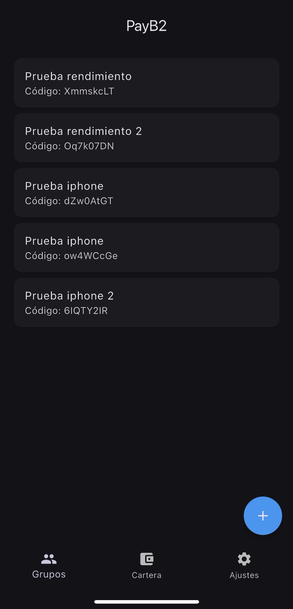
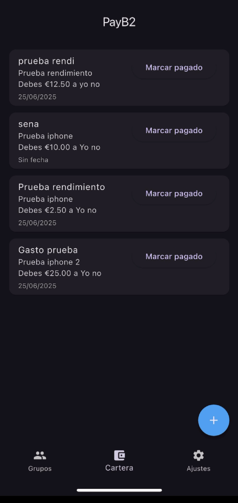
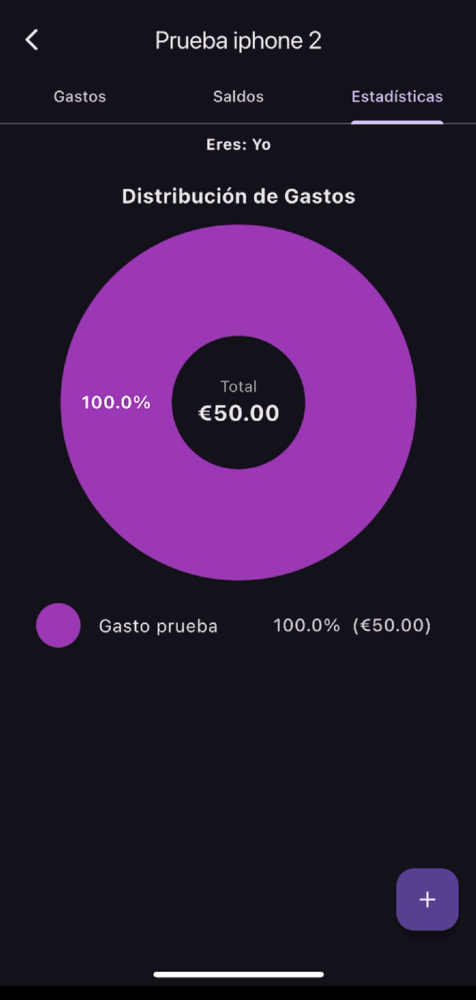

# 💸 PayB2

**PayB2** es una aplicación móvil desarrollada en Flutter que permite gestionar gastos compartidos de forma rápida, sencilla y sincronizada entre usuarios. Ideal para grupos de amigos, compañeros de piso o viajes.

Desarrollado por **Alexander Caiza** como Trabajo de Fin de Grado en Ingeniería Multimedia.

---

## 🚀 Funcionalidades principales

- 📱 Crear y unirse a grupos con otros usuarios.
- 🧾 Añadir gastos y dividirlos entre los miembros.
- 🔔 Notificaciones push al marcar deudas como pagadas.
- 🔄 Gastos periódicos automáticos (semanales, mensuales, anuales...).
- 💰 Vista de saldos con detalle de deudas.
- 📡 Sincronización en tiempo real mediante Firebase.

---

## 🛠️ Tecnologías utilizadas

- **Flutter** (Dart)
- **Firebase**: Firestore, Cloud Functions, Cloud Messaging, Authentication
- **Xcode** / **Android Studio** (para pruebas en dispositivos físicos y simuladores)
- **DevTools**, **Xcode Instruments**, **Time Profiler** (pruebas de rendimiento)

---

## 📦 Instalación del proyecto

1. **Clona el repositorio:**

``bash
git clone https://github.com/alexanci05/payb2.git
cd payb2

2. **Instala dependencias:**

``bash
flutter pub get

3. **Instala dependencias:**

Asegúrate de haber añadido los archivos google-services.json (Android) y GoogleService-Info.plist (iOS) dentro de las rutas correspondientes en el proyecto.

4. **Ejecuta en modo debug o profile:**

``bash
flutter run

---

## 📦 Pruebas de rendimiento

El rendimiento se ha evaluado mediante:

- Flutter DevTools: análisis de uso de CPU, jank, renderizado de frames, etc.
- Xcode Instruments: control de uso de CPU y análisis con Time Profiler en iOS.
- Pruebas manuales de volumen: simulación de creación masiva de grupos, usuarios y gastos para verificar estabilidad del backend en Firebase.

---

## 📷 Capturas de pantalla

### 🏠 Primera pantalla

### 👥 Vista grupos

### 💳 Cartera

### 📈 Estadisticas

---

## 📄 Licencia

Este proyecto es de uso académico y personal. No está destinado a producción comercial sin consentimiento del autor.

---

## ✍️ Autor

**Esteban Alexander Caiza Inga**

  

